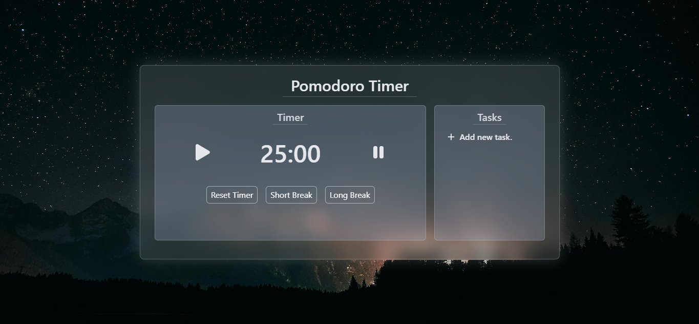

# Pomodoro Timer


## 📖 Descrição do Projeto

Este repositório contém o código-fonte de um **Pomodoro Timer** desenvolvido com **React**, **Vite**, **TailwindCSS** e **ShadCN UI**. A aplicação implementa a técnica Pomodoro para aumentar a produtividade ao dividir o trabalho em sessões de 25 minutos, seguidas por intervalos de descanso.

O projeto utiliza **React** para a construção da interface interativa, **TailwindCSS** para o design responsivo e **ShadCN UI** para componentes estilizados. **Vite** é usado como ferramenta de bundling para um desenvolvimento mais rápido e eficiente. O código é padronizado e verificado com **ESLint** para garantir boa qualidade de código.

---

## 🌐 Demonstração

### 💻 Captura de Tela



---

## 🛠 Tecnologias Utilizadas

- **Vite**: Ferramenta de build rápida e moderna para React.
- **React**: Biblioteca JavaScript para construção da interface de usuário.
- **TailwindCSS**: Framework de CSS utilitário para design responsivo e personalizável.
- **ShadCN UI**: Biblioteca de componentes UI reutilizáveis e estilizados.
- **React Icons**: Conjunto de ícones para uso em projetos React.
- **ESLint**: Ferramenta para identificar e corrigir problemas no código JavaScript.

---

## 🚀 Como Utilizar

1. Clone este repositório para sua máquina local:

   ```bash
   git clone https://github.com/Adrwaan/pomodoro-timer.git
   ```

2. Acesse o diretório do projeto:

   ```bash
   cd pomodoro-timer
   ```

3. Instale as dependências necessárias:

   ```bash
   npm install
   ```

   ou

   ```bash
   pnpm install
   ```

4. Inicie o ambiente de desenvolvimento:

   ```bash
   npm run dev
   ```

   ou

   ```bash
   pnpm dev
   ```

5. Abra o navegador e acesse o endereço exibido no terminal.

---

## ✨ Funcionalidades Implementadas

- **Timer Pomodoro**: Cronômetro para sessões de trabalho e intervalos de descanso.
- **Controles Interativos**: Opções para iniciar, pausar e resetar o timer.
- **Notificações de Término**: Alerta sonoro e visual quando um ciclo termina.
- **Design Responsivo**: Layout adaptável a diferentes tamanhos de tela.
- **Interface Estilizada**: Componentes UI modernos com ShadCN UI e TailwindCSS.

---

## 👤 Autor

Desenvolvido por [**Adrwaan**](https://github.com/Adrwaan).
